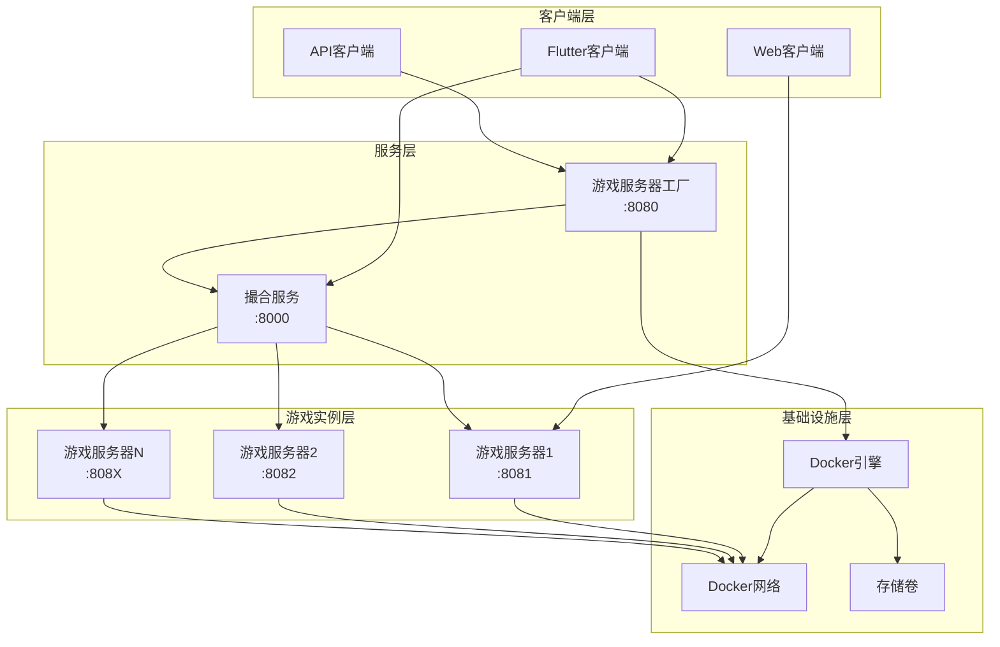
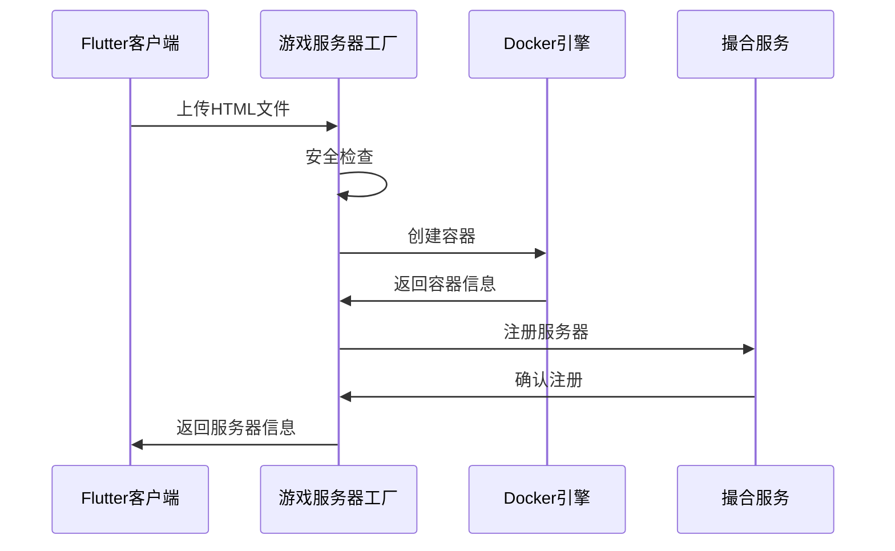
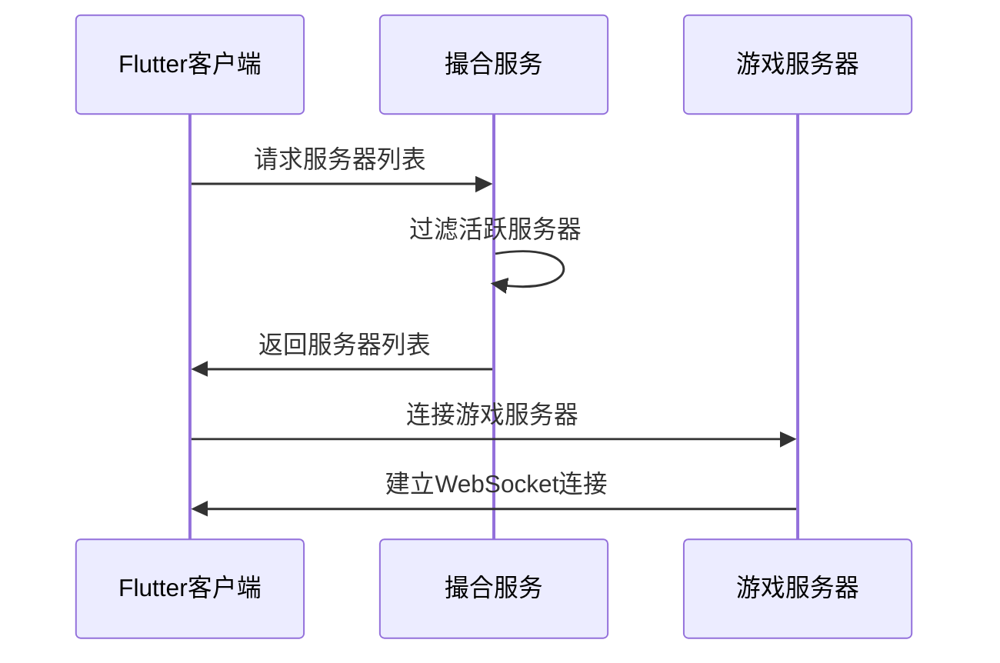
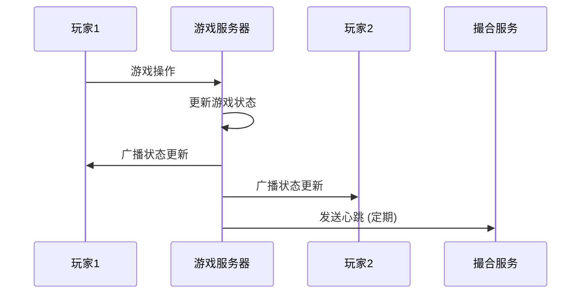
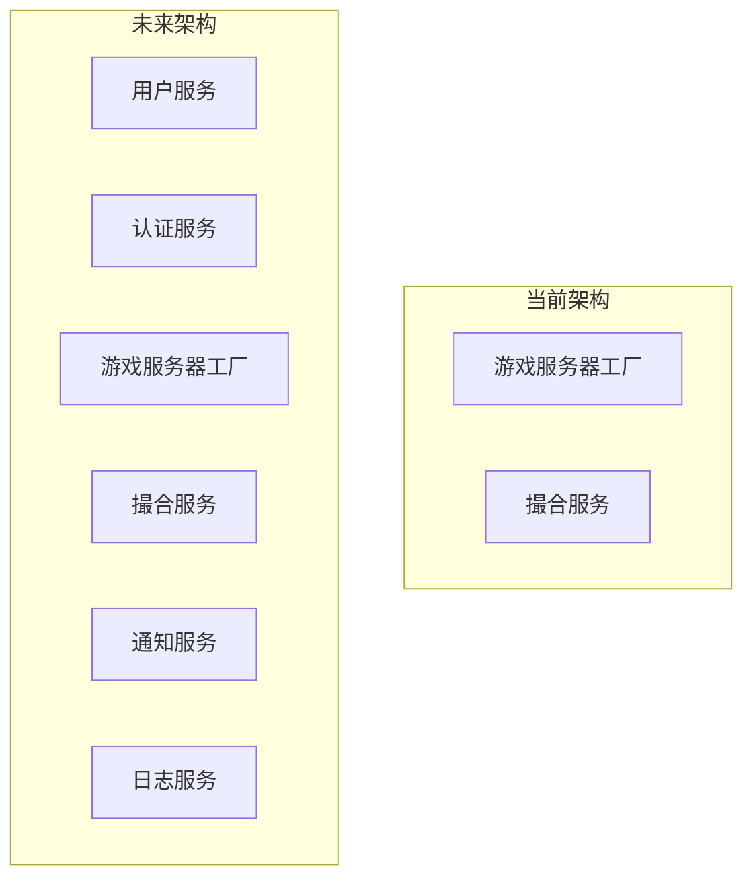

# 系统架构

AI游戏平台采用微服务架构，由四个核心组件组成，支持HTML游戏的上传、部署、发现和实时游玩。

## 🏗️ 整体架构



## 🧩 核心组件

### 1. 游戏服务器工厂 (Game Server Factory)

**职责**: 代码上传、安全检查、容器管理

**技术栈**:
- **语言**: Python 3.8+
- **框架**: FastAPI
- **容器**: Docker
- **依赖**: Docker SDK, uvicorn

**核心功能**:
- HTML/ZIP文件上传和验证
- JavaScript代码安全扫描
- Docker容器动态创建和管理
- 资源监控和自动清理
- 服务器生命周期管理

**架构模式**:
```python
# 分层架构
├── API层 (FastAPI路由)
├── 业务逻辑层 (服务类)
├── 数据访问层 (Docker SDK)
└── 基础设施层 (Docker引擎)
```

### 2. 撮合服务 (Matchmaker Service)

**职责**: 游戏服务器注册、发现、心跳管理

**技术栈**:
- **语言**: Python 3.8+
- **框架**: FastAPI
- **存储**: 内存存储 (未来支持Redis)
- **通信**: HTTP REST API

**核心功能**:
- 游戏服务器注册和注销
- 心跳监控和超时清理
- 服务器列表查询和过滤
- 负载均衡和服务发现

**数据模型**:
```python
class GameServer:
    server_id: str
    ip: str
    port: int
    name: str
    max_players: int
    current_players: int
    metadata: dict
    last_heartbeat: datetime
    uptime: int
```

### 3. 游戏服务器模板 (Game Server Template)

**职责**: 运行用户上传的HTML游戏

**技术栈**:
- **语言**: Node.js
- **框架**: Express.js
- **实时通信**: Socket.IO
- **容器**: Docker

**核心功能**:
- 静态文件服务 (HTML/CSS/JS)
- WebSocket实时通信
- 自动注册到撮合服务
- 心跳维持和状态报告

**运行时架构**:
```javascript
// 每个游戏服务器实例
├── Express服务器 (静态文件)
├── Socket.IO服务器 (实时通信)
├── 心跳管理器 (定时任务)
└── 游戏逻辑 (用户代码)
```

### 4. Flutter客户端 (Universal Game Client)

**职责**: 用户界面、游戏管理、服务器交互

**技术栈**:
- **语言**: Dart
- **框架**: Flutter
- **状态管理**: Provider
- **网络**: HTTP + WebSocket

**核心功能**:
- 代码上传界面
- 服务器列表和管理
- 游戏房间浏览
- 实时游戏体验

**架构模式**:
```dart
// MVVM架构
├── Views (UI组件)
├── ViewModels (业务逻辑)
├── Models (数据模型)
├── Services (网络服务)
└── Providers (状态管理)
```

## 🔄 数据流

### 1. 游戏上传流程



### 2. 游戏发现流程



### 3. 实时游戏流程



## 🔧 技术选型理由

### 后端技术选择

#### Python + FastAPI
**选择理由**:
- **快速开发**: FastAPI提供自动API文档生成
- **类型安全**: 内置类型检查和验证
- **异步支持**: 高并发处理能力
- **生态丰富**: Docker SDK等工具支持完善

#### Node.js + Express
**选择理由**:
- **JavaScript统一**: 与前端游戏代码语言一致
- **实时通信**: Socket.IO成熟稳定
- **轻量级**: 适合游戏服务器快速启动
- **生态系统**: npm包生态丰富

### 前端技术选择

#### Flutter
**选择理由**:
- **跨平台**: 一套代码支持多平台
- **性能优秀**: 接近原生应用性能
- **UI丰富**: Material Design组件库
- **热重载**: 开发效率高

### 基础设施选择

#### Docker
**选择理由**:
- **隔离性**: 每个游戏运行在独立容器中
- **可移植性**: 跨平台部署一致性
- **资源控制**: 精确的资源限制和监控
- **快速部署**: 秒级容器启动

#### Socket.IO
**选择理由**:
- **实时通信**: WebSocket + 降级机制
- **房间管理**: 内置房间和命名空间支持
- **跨平台**: 支持多种客户端
- **可靠性**: 自动重连和错误处理

## 🔒 安全架构

### 1. 代码安全

```python
# 安全检查流程
class SecurityScanner:
    def scan_javascript(self, code: str) -> List[SecurityIssue]:
        issues = []
        
        # 检查危险模块导入
        if 'require(\'fs\')' in code:
            issues.append(SecurityIssue('文件系统访问', 'high'))
        
        # 检查危险函数
        if 'eval(' in code:
            issues.append(SecurityIssue('代码执行', 'high'))
        
        return issues
```

### 2. 容器隔离

```yaml
# Docker安全配置
security_opt:
  - no-new-privileges:true
read_only: true
tmpfs:
  - /tmp
cap_drop:
  - ALL
cap_add:
  - NET_BIND_SERVICE
```

### 3. 网络安全

```yaml
# Docker网络隔离
networks:
  game-network:
    driver: bridge
    internal: false  # 允许外部访问
    ipam:
      config:
        - subnet: 172.20.0.0/16
```

## 📊 性能架构

### 1. 资源管理

```python
class ResourceManager:
    def __init__(self):
        self.max_containers = 50
        self.memory_limit = "512m"
        self.cpu_limit = 1.0
        self.idle_timeout = 1800  # 30分钟
    
    def cleanup_idle_containers(self):
        # 自动清理闲置容器
        pass
    
    def monitor_resources(self):
        # 监控系统资源使用
        pass
```

### 2. 负载均衡

```python
class LoadBalancer:
    def select_server(self, servers: List[GameServer]) -> GameServer:
        # 基于玩家数量的负载均衡
        return min(servers, key=lambda s: s.current_players)
```

### 3. 缓存策略

```python
# 服务器列表缓存
@lru_cache(maxsize=128, ttl=30)
def get_active_servers():
    return matchmaker.get_servers()
```

## 🔄 扩展性设计

### 1. 水平扩展

```yaml
# Docker Swarm扩展
version: '3.8'
services:
  game-server-factory:
    deploy:
      replicas: 3
      update_config:
        parallelism: 1
        delay: 10s
      restart_policy:
        condition: on-failure
```

### 2. 数据库扩展

```python
# 未来数据库支持
class DatabaseAdapter:
    def __init__(self, db_type: str):
        if db_type == 'redis':
            self.client = RedisClient()
        elif db_type == 'postgresql':
            self.client = PostgreSQLClient()
        else:
            self.client = MemoryClient()
```

### 3. 微服务拆分



## 🔍 监控架构

### 1. 健康检查

```python
class HealthChecker:
    def check_component_health(self) -> Dict[str, str]:
        return {
            'docker_manager': self.check_docker(),
            'resource_manager': self.check_resources(),
            'matchmaker_service': self.check_matchmaker()
        }
```

### 2. 指标收集

```python
class MetricsCollector:
    def collect_system_metrics(self):
        return {
            'container_count': self.get_container_count(),
            'memory_usage': self.get_memory_usage(),
            'cpu_usage': self.get_cpu_usage(),
            'network_io': self.get_network_io()
        }
```

### 3. 日志聚合

```python
# 结构化日志
import structlog

logger = structlog.get_logger()
logger.info("Container created", 
           server_id=server_id, 
           container_id=container_id,
           port=port)
```

## 🚀 部署架构

### 1. 开发环境

```yaml
# docker-compose.yml
version: '3.8'
services:
  matchmaker:
    build: ./matchmaker_service/matchmaker
    ports: ["8000:8000"]
    environment:
      - ENVIRONMENT=development
  
  game-server-factory:
    build: ./game_server_factory
    ports: ["8080:8080"]
    volumes:
      - /var/run/docker.sock:/var/run/docker.sock
```

### 2. 生产环境

```yaml
# docker-compose.prod.yml
version: '3.8'
services:
  matchmaker:
    image: ai-game-platform/matchmaker:latest
    deploy:
      replicas: 2
      resources:
        limits:
          memory: 512M
          cpus: '0.5'
    environment:
      - ENVIRONMENT=production
      - LOG_LEVEL=INFO
```

### 3. 云部署

```yaml
# Kubernetes部署示例
apiVersion: apps/v1
kind: Deployment
metadata:
  name: game-server-factory
spec:
  replicas: 3
  selector:
    matchLabels:
      app: game-server-factory
  template:
    metadata:
      labels:
        app: game-server-factory
    spec:
      containers:
      - name: factory
        image: ai-game-platform/factory:latest
        ports:
        - containerPort: 8080
```

## 📈 未来架构演进

### 短期目标 (3-6个月)
- 添加用户认证和授权
- 实现数据持久化 (Redis/PostgreSQL)
- 增加监控和告警系统
- 支持更多游戏类型

### 中期目标 (6-12个月)
- 微服务进一步拆分
- 实现服务网格 (Istio)
- 添加CI/CD流水线
- 支持多区域部署

### 长期目标 (1-2年)
- 云原生架构改造
- 支持Serverless部署
- AI辅助游戏开发
- 区块链游戏支持

---

**相关文档**: [设计理念](design-principles.md) | [技术选型](technology-choices.md) | [安全模型](security-model.md)